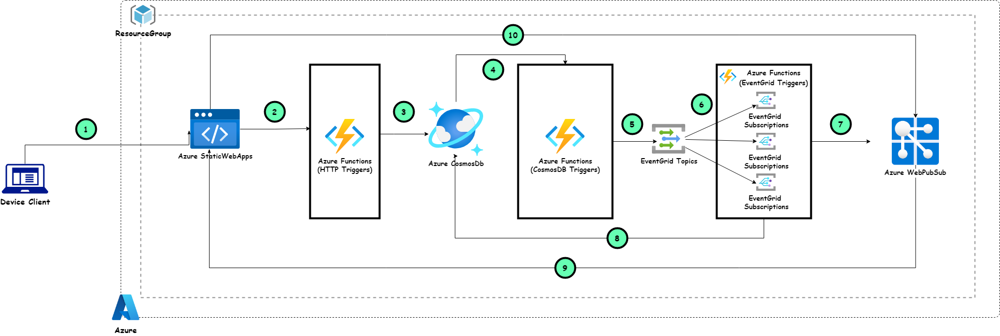

# CosmosPark

This repo contains a solution that creates a serverless chat application with a gamified experience that stores 
data in Azure Cosmos DB, Azure Functions and Azure EventGrid for events processing, Azure WebPubSub for websocket client messaging and
Azure Static WebApps for hosting

# Potential use cases

- Create and model chat application 
- Integrate leaderboard and live scheduled tasks 
- Customize maps with realtime data
- Track statistics of a individual user 
- Work with event-driven & serverless architecture

# CosmosPark Premier League architecture

# CosmosDB DataFlow

  <b> Realtime Cosmic chat app built using various Azure services </b>

# Components

## Azure static webapps

[Azure staticwebapps](https://azure.microsoft.com/en-us/services/app-service/static/#overview) accelerate your app development with managed global availability for static content hosting and dynamic scale for integrated serverless APIs. 
In this architecture, Azure StaticWebApps is used as our hosting platform that hosts both frontend and backend REST APIs.

## Azure Maps

[Azure Maps](https://azure.microsoft.com/en-in/services/azure-maps/#azuremaps-overview) allows you to add maps, spatial analytics, and mobility solutions to your apps with geospatial APIs

## Azure Functions

[Azure Functions](https://azure.microsoft.com/en-us/services/functions/) is a serverless platform solution on Azure that allows developers to write compute-on-demand code, 
without having to maintain any of the underlying systems. In this architecture, Azure Functions can host APIs, and any work that needs to be done asynchronously, such as running periodic jobs and computing statistics over a certain period of time.

## Azure CosmosDB

[Azure CosmosDB](https://azure.microsoft.com/en-us/services/cosmos-db/) is a fully managed NoSQL database service for modern app development. In our application we make use of Azure CosmosDB in a serverless mode, where
automatic provision of throughput occurs and will provide us moderate performance. This is also suitable for workloads of any size and a cost-effective solution.

## Azure EventGrid

[Azure EventGrid](https://azure.microsoft.com/en-us/services/event-grid/) Simplify your event-based apps with Event Grid, a single service for managing routing of all events from any source to any destination. Designed for high availability, consistent performance, and dynamic scale, Event Grid lets you focus on your app logic rather than infrastru

## Azure WebPubSub

[Azure WebPubSub](https://azure.microsoft.com/en-us/services/web-pubsub/) Develop web applications with real-time messaging using Azure Web PubSub, a fully managed service that supports native and serverless WebSockets. Create loosely coupled, scalable applications—including chats, live broadcasting, and IoT dashboards—with the publish-subscribe messaging pattern. Keep your focus on functionality while Web PubSub manages the flow of data and content to your webpages and mobile applications.

# Workflow

The solution is built on five pillars, including:

- Clients
- Communication components
- Events processing components
- APIs and business logic 
- Storage and infrastructure services

1. Device client (website/mobile) can access this application in browser. Browser pulls static resources and product images from Azure Static WebApps. We have Azure maps integrated in our landing page
that requires user to allow the location permissions. Once permission is provided user's location will be added as a marker on the map.   On the lower portion of the maps, user could find a place where list of tasks will be asigned dynamically for each users. To complete a task one should speak with a person from the specified location 
on the tasks. In order to do that , search for the particular location and select on any marker around that region, now users will be prompted to chat with them. Click on the button to initiate talks.
Once users have sent a message to another person from the specified location in the task he/she will be awarded with specific points based on the criticality of each tasks.Users can also check their rankings in the lower right corner of the screen, where the leaderboard is placed.
  The source of the frontend is found in <b>src/app</b> and consists of a plain HTML + Javascript application.

2. Fontend communicates with the backend APIs to perform business use cases. We have used Azure functions HTTP Triggers to expose these APIs. The source of this backend API can be found in **src/api/httpTrigger** and consists of a .NET 6 Azure function app.

    | Verb  | FunctionName |
    | ----- | ---- |
    | POST | CreateChat |
    | POST | CreateUser |
	| GET | GetAllChatsByUserId |
	| GET | GetAllMessagesByChatId |
	| GET | GetAllUsers |
	| GET | GetAllUsersByCountryCode |
	| GET | GetConnectionDetails |
	| GET | GetCosmosLeaderBoards |
	| GET | GetToken |
	| GET | GetUserById |
	| GET | LookupAddress |

3. For persisting the data we use Azure Cosmos DB and below are the containers. Azure CosmosDB is our core component from which all data are distributed to other event processing/communication components.
  - CosmicUsers
  - CosmicChats
  - CosmicUserChats
  - CosmicUserTasks
  - CosmicTaskValidator
  - CosmicLeaderboards
  - CosmicGlobalTimer
 
4. Change Feeds are enabled for few of the containers that needs to be listened for any changes and it will be passed on to different components in the downstream. We have used Azure Functions CosmosDB Triggers for
handling these business use cases. 

    | Verb  | ChangeFeedEnabled? |
    | ----- | ---- |
    | CosmicUsers | Yes |
	| CosmicChats | Yes |
	| CosmicUsers | Yes |
	| CosmicUserChats | Yes |
	| CosmicTaskValidator | No |
	| CosmicUserTasks | Yes |
	| CosmicLeaderboards | Yes |
	| CosmicGlobalTimer | No |

5. Now the application publishes changefeed events using Azure EventGrid. EventGrid helps us to decouple event publishers from event subscribers , by using a pub/sub model and a simple HTTP-based event delivery. This 
process allows the system to build scalable serverless applications.

6. We have different subscribers (event handlers) built using Azure Function to subscribe to the events published from changefeed. Based on the event criteria , the events are filtered and reaches to the right subscribers in a near real-time.

7. Event handlers then publishes the event data to Azure Web pubsub service that acts as our messaging component, responsible for live updates in the frontend without need of us to refresh the page with the help of websockets

8. Few event handlers writes those event data to a different container in Azure cosmosdb for further processing and normalization of data.

9. Azure WebpubSub publishes the message back to frontend with the help of websockets.

10. And similarly frontend communicates directly to Azure Web PubSub service for few business use case where persisting data is not a reliable option.
	

# Application Screens

