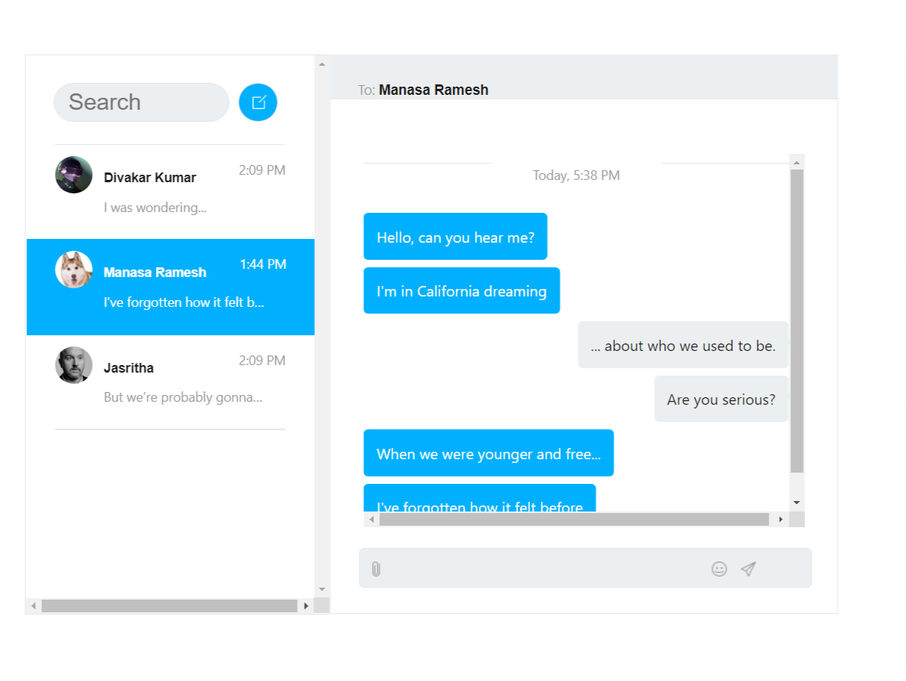

# CosmosPark

This repo contains a solution that creates a serverless chat application with a gamified experience that stores 
data in Azure Cosmos DB, Azure Functions and Azure EventGrid for events processing, Azure WebPubSub for websocket client messaging and
Azure Static WebApps for hosting

# Potential use cases

- Create chat application 
- Integrate leaderboard and live scheduled tasks for each users
- Customize maps with various realtime markers
- Track statistics of a individual user 

# CosmosPark Premier League architecture

  <b> Realtime Cosmic chat app built using various Azure services </b>

# Components

## Azure static webapps
 Accelerate your app development with managed global availability for static content hosting and dynamic scale for integrated serverless APIs. 
Experience high productivity with a tailored local development experience, CI/CD workflows to build and deploy your app, and unified hosting and management in the cloud.
## Azure Maps

# Application Screens

